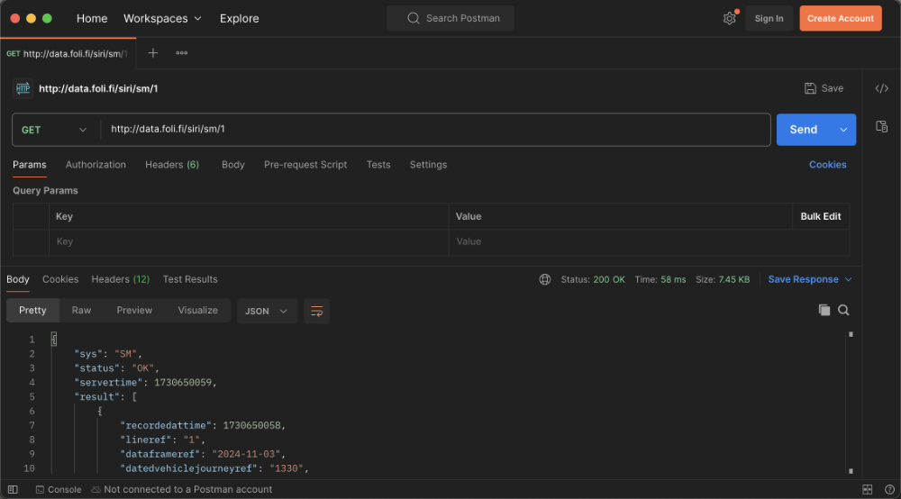
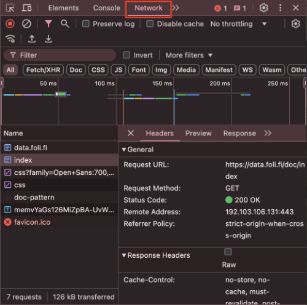
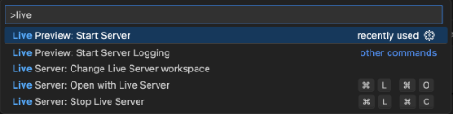

### [<- Viikko 20](./viikko-20.md) [Viikko 22 ->](./README.md)

# Viikko 21
## Maanantai 
Perehdytään HTTP:een ja RESTiin tarkemmin.

### HTTP

**HTTP (HyperText Transfer Protocol)** on webin perustana oleva tilaton tiedonsiirtoprotokolla, jolla perinteisesti tarjoiltiin html-sivuja palvelimelta selaimille. Tämä on yhä sen keskeinen käyttötarkoitus, mutta nykyisin sen yli liikkuu myös muunlaista dataa, usein **REST (REpresentational State Transfer)**-arkkitehtuuria käyttäen.

HTTP-liikenne koostuu **HTTP-pyynnöistä (HTTP request)** ja **HTTP-vastauksista (HTTP-response):** asiakassovellus lähettää **pyynnön,** jonka vastaanottava palvelin käsittelee, ja palauttaa siihen **vastauksen.**

HTTP-viestit sisältävät seuraavat osat:
- **Aloitusrivi (Start line),** joka kertoo käytetyn HTTP-version, sekä pyynnössä käytetyn HTTP-metodin, ja vastauksessa statuskoodin
- **Otsakkeet (Headers),** jotka sisältävät viestin metadataa kuten sisällön datatyypin ja esim. yhteyden ylläpitoon ja autentikointiin liittyviä tietoja
- Valinnainen **viestirunko (Body),** joka sisältää varsinaisen siirrettävän datan

Yksikertainen HTTP-pyyntö voi olla esim. tämän näköinen:
```
POST /users HTTP/1.1
Host: example.com
Content-Type: application/json
Content-Length: 40

{
    "name": "John Doe",
    "age": 30
}

```
- Aloitusrivillä määritellään, että kyseessä on **POST**-tyyppinen pyyntö (eli halutaan luoda uusi resurssi) polkuun **/users**, ja käytetty HTTP-versio on **1.1**. (1.1 on yhä laajasti käytetty, mutta versiot 2 ja 3 tarjoavat suorityskykyparannuksia)
- Aloitusrivin jälkeen on otsakkeet Host, Content-Type ja Content-Length:
    - **Host** kertoo URL:n, johon yhteys otetaan
    - **Content-Type** kertoo missä muodossa viestirungon tieto on (tässä tapauksessa JSON, toinen yleinen muoto on application/x-www-form-urlencoded eli URL-parametrimuodossa annettu lomakedata)
    - **Content-Length** kertoo minkä mittainen viestirunko on (40 merkkiä)
- Lopuksi tyhjän rivin jälkeen on viestirunko, joka sisältää **JSON**-muotoisen datapaketin

HTTP-vastaus puolestaan voi näyttää esim. tällaiselta:
```
HTTP/1.1 201 Created
Content-Type: application/json
Location: http://example.com/users/123

{
  "message": "New user created",
  "user": {
    "id": 123,
    "name": "John Doe",
    "age": 30
  }
}
```

- Aloitusrivillä on ensin käytetty **HTTP**-versio (1.1), kolminumeroinen **statuskoodi** sekä **statusteksti**
- Sen jälkeen on otsakkeet Content-Type ja Location:
    - **Content-Type** kertoo taas viestirungon formaatin
    - **Location** on uudelleenohjauksessa käytetty otsake. 201-tyyppisessä vastauksessa se kertoo osoitteen, josta luotu resurssi löytyy
- Lopuksi tyhjän rivin jälkeen on viestirunko, joka tässä tapauksesssa sisältää **vastausviestin** sekä **luodun resurssin tiedot**

### REST

REST on ohjelmointirajapintojen toteuttamiseen tarkoitettu arkkitehtuurityyli. Sen kantavat periaatteet ovat:
1. Asiakas-palvelinmalli
2. Tilattomuus
3. Välimuistin hyödyntäminen
4. Yhdenmukainen rajapinta
5. Kerrostettu järjestelmä

REST perustuu siihen, että palvelinta voidaan pyytää toteuttamaan erilaisia toimenpiteitä (luominen, lukeminen, päivittäminen ja poistaminen, CRUD) eri resursseihin. Resurssit on eritelty *endpointeilla* eli osoitteilla. Esimerkiksi voimme lähettää DELETE-pyynnön osoitteeseen `tilavaraus.fi/tilat/5`. Tässä otamme yhteyden palvelimeen, joka sijaitsee osoitteessa `tilavaraus.fi`, ja haluamme kohdistaa operaation resurssiin `/tilat/5`, eli tilaresurssiin, jonka ID on 5. RESTiä käytettäessä tietoa siirretään yleensä JSON-muodossa.

REST-rajapintojen testaamiseen ja debuggaamiseen on useita työkaluja. Suosituin niistä on luultavasti **Postman.** Postmanilla voidaan lähettää halutun muotoisia HTTP-kutsuja halutuilla parametreilla, ja tarkastella palautunutta HTTP-vastausta. Alla olevassa kuvassa on lähetetty GET-pyyntö osoitteeseen `http://data.foli.fi/siri/sm/1`, ja alla näkyy osa palvelimen palauttamaa JSON-dataa:



Lisäksi web-sovellusta kehitettäessä lähteviä ja palautuvia HTTP-viestejä voi tarkastella selaimen kehitystyökaluilla **Network**-näkymästä. Kehitystyökalut avautuvat yleisimmillä selaimilla F12-painikkeella:



### Harjoituksia

Perehdy sivustolla [data.foli.fi/doc/index](https://data.foli.fi/doc/index) annettuihin dokumentaatioihin, ja testaa HTTP-pyyntöjä sivun rajapintoja vasten käyttäen Postmania ja selaimen kehitystyökaluja.

### Tehtävä

Luo Pythonilla REST API aiemmin luodulle tilavarauskannalle. Käytetään tässä samoja palikoita kuin viime perjantain web-palvelintehtävässä, eli http-kirjaston serveriä ja mysql-connectoria:
- Luo tauluille **tilat,** **varaajat** ja **varaukset** GET-endpointit, jotka palauttavat taulun rivit JSON-muodossa.
- Luo myös POST-endpointit, jotka ottavat vastaan tarvittavat parametrit, jotta tauluihin voi luoda uusia rivejä
- Luo DELETE-endpointit, joilla tauluista voi poistaa rivejä. Ota poistettavan resurssin id vastaan osana polkua, esim. `/varaajat/3`

### Resursseja
HTTP:
- https://www.freecodecamp.org/news/what-is-http/
- https://www.youtube.com/watch?v=iYM2zFP3Zn0

REST:
- https://www.freecodecamp.org/news/what-is-a-rest-api/
- https://www.youtube.com/watch?v=Q-BpqyOT3a8


## Tiistai 

**Node** on JavaScript-ajoympäristö, jossa voidaan siis ajaa JavaScript-koodia suoraan tietokoneella selaimen ulkopuolella. Jotta Nodea voidaan käyttää, se pitää ensin ladata ja asentaa osoitteesta https://nodejs.org/en/download/prebuilt-installer.

Nodea käytetään samaan tapaan kuin esim. Python-ajoympäristöä: kirjoittamalla terminaaliin komento `node` siirrytään Noden interaktiiviseen komentotulkkiin, jossa voidaan testata yksittäisiä JavaScript-komentoja. Toisaalta jos meillä on JavaScript-ohjelmatiedosto, annetaan komento `node [tiedostonnimi]`, jolloin Node suorittaa tiedostossa sijaitsevan koodin. Nodea voi käyttää myös palvelinkoodin kirjoittamiseen, mutta CodePointissa toteutamme backendin Pythonilla. Frontendin puolella hyödynnämme kuitenkin Noden moduulikirjastoja.

Noden mukana koneelle asentuu [NPM](https://docs.npmjs.com/), joka on Noden pakettienhallintajärjestelmä. NPM-ekosysteemi on valtava ja koko ajan kasvava kokonaisuus erilaisia moduuleita ja kirjastoja. Nykyinen web-frontend-kehitys perustuu käytännössä NPM-moduuleihin.

NPM otetaan projektissa käyttöön ajamalla projektikansiossa komento `npm init`, joka kyselee muutamia perustietoja, ja luo NPM:n konfiguraatiotiedoston nimeltä `package.json`. Tämä tiedosto sisältää projektin metatietoa, mukaanlukien projektiin asennetut NPM-moduulit eli riippuvuudet.

Yleensä moduuleita käytetään osana frontend-frameworkkia kuten React tai Angular, mutta niiden koodi on normaalia JavaScriptiä, ja sitä voidaan käyttää myös "perinteiseen" tyyliin seuraavasti:

Luo ja avaa projektikansio, ja aja `npm init`, jotta saadaan projekti alustettua. Aja sitten komento `npm intall axios`, joka asentaa Axios-kirjaston, joka helpottaa HTTP-kutsujen tekemistä ja käsittelyä JavaScriptissä. Jos nyt katsot kansiossa olevaa `package.json`-tiedostoa, huomaat, että sen dependencies-osioon on lisätty kohta Axios, ja projektikansioon on ilmestynyt kansio `node_modules`, jonka sisällä on Axios-moduulun koodi ja sen riippuvuudet.

Luo kansioon tiedosto `index.html`, ja kopioi seuraava sisältö siihen:

```html
<!DOCTYPE html>
<head>
    <meta charset="UTF-8">
    <title>Föli test</title>
    <script defer src="./node_modules/axios/dist/axios.min.js"></script>
    <script defer src="index.js"></script>
</head>
<body>
    <h1>Föli pysäkin tiedot</h1>
    <button onclick="getData()">Hae tiedot</button>
    <ul id="stops-list"></ul>
</body>
</html>
```

Seuraavaksi luo tiedosto `index.js`, ja kopioi seuraava sisältö siihen:

```js
function getData() {
    axios('http://data.foli.fi/siri/sm/672')
        .then(d=>createList(d.data.result))
}

function createList(stops) {
    const listEl = document.getElementById('stops-list')
    for (let stop of stops) {
        const el = document.createElement('li')
        const departureTime = new Date(parseInt(stop.expecteddeparturetime) * 1000 )
        const text = stop.lineref + ' ' + stop.destinationdisplay + ' ' + departureTime.toLocaleTimeString()
        el.innerHTML = text
        listEl.append(el)
    }
}
```

Asenna vielä VSCodeen laajennus [Live Preview](https://marketplace.visualstudio.com/items?itemName=ms-vscode.live-server). Tämä lisäke käynnistää yksinkertaisen HTTP-palvelimen, joka tarjoilee projektikansiossa olevia tiedostoja. Kun Live Preview on asennettu, avaa VSCoden komentopaletti näppäinyhdistelmällä <kbd>shift</kbd>+<kbd>ctrl</kbd>+<kbd>p</kbd>, kirjoita hakukenttään `live` ja valitse "Start Server":



Tämä avaa koodin viereen uuden paneelin, johon avautuu selainnäkymä osoitteeseen http://localhost:3000. Kun painat näkymässä olevaa painiketta, skripti hakee pysäkin 672 (Codepointin lähin bussipysäkki) tulevien bussien tiedot ja purkaa ne listariveiksi, jotka se sijoittaa HTML-koodissa olevan `<ul>` -elementin sisään. 

### Tehtävä 1: JS-client tilavaraukseen
Katso mallia ylläolevasta esimerkistä, ja luo näkymät, jotka esittävät tilavarauskannan tiedot käyttäen aiemmin luodun REST API-palvelimen endpointteja. Voit tehdä kunkin taulun omaan HTML-tiedostoonsa, ja rakentaa niiden välille simppelin navigaation. Kun olet saanut taulujen sisällöt näkyviin, lisää näkymiin vielä rivien poistaminen ja lisääminen.

#### Resursseja
- https://nodejs.org/en/learn/getting-started/introduction-to-nodejs
- https://docs.npmjs.com/about-npm
- https://axios-http.com/docs/intro
- https://www.youtube.com/watch?v=P3aKRdUyr0s


## Keskiviikko 
**Autentikointi** (tunnistus) on oleellinen osanen missä hyvänsä verkossa pyörivässä palvelussa. Web-maailman kaksi perustavaa autentikointimetodia ovat **istunnot** (sessions) ja **tokenit** (tokens).

### Istunnot
Istuntoihin perustuva tunnistus toimii niin, että kun käyttäjä ottaa yhteyden palvelimeen, hän aloittaa lähettämällä sille käyttäjänimen ja salasanan. Palvelin tarkistaa omasta kannastaan, onko kyseisellä käyttäjänimellä rekisteröity käyttäjää, ja vastaavatko käyttäjänimi ja salasana toisiaan. Jos näin on, palvelin luo käyttäjälle **istunnon** eli **session**, ja lähettää istunnon tunnisteen (session id) takaisin käyttäjän selaimelle Set-Cookie -vastausotsakkeessa.

Tästä eteenpäin aina kun käyttäjä yrittää tehdä jotain palvelimen resursseilla, selain lähettää automaattisesti palvelimen asettaman tunnisteen http-pyynnön ohessa evästeenä (cookie). Palvelin tarkastaa, että tunnistetta vastaava istunto on olemassa ja voimassa, ja antaa käyttäjälle pääsyn niihin resursseihin, joihin hänellä on oikeus. Kun käyttäjä kirjautuu ulos, palvelin poistaa istunnon käytöstä.

Istuntojen tapauksessa siis **palvelin** säilöö tiedon palveluun kirjautuneista käyttäjistä.

### Tokenit
Tokeniin perustuva tunnistus puolestaan toimii niin, että ensin käyttäjä kirjautuu palveluun samalla tavoin kuin edellisessä esimerkissä, mutta palvelin ei säilö tietoa kirjautumisesta, vaan käyttäjän tunnistamisen jälkeen se luo **tokenin** eli tietopaketin, joka sisältää palvelun käytön kannalta tarvittavat tiedot (esim. tokenin voimassaoloajan, käyttäjän id:n, käyttöoikeustiedot, nimen ja sähköpostiosoitteen). Tokeni on kryptografisesti allekirjoitettu niin, että se voidaan luotettavasti tunnistaa palvelimen luomaksi, eikä sitä pysty muokkaamaan jälkikäteen. Web-maailmassa tokeni yleensä tarkoittaa JWT:tä eli [JSON Web Tokenia](https://jwt.io/).

Palvelin palauttaa tämän tokenin takaisin käyttäjälle, ja tämän jälkeen asiakassovellus sisällyttää sen jokaiseen palvelinkutsuun. Tokeni voidaan palauttaa evästeessä tai pyynnön **Authentication**-otsakkeessa. Palvelin tunnistaa käyttäjän ja tarkistaa tämän valtuutuksen tarkistamalla, että allekirjoitus vastaa tokenin tietosisältöä. Palvelimen ei siis tarvitse erikseen pitää kirjaa, onko käyttäjä kirjautunut vai ei.

Tässä tunnistuskeinossa siis tieto kirjautumisesta säilytetään käyttäjän päässä eli **asiakassovelluksella.**

### CORS
Kun sovellukseen lisätään tunnistautuminen, pitää samalla ottaa käyttöön CORS-mekanismi [(Cross-Origin Resource Sharing)](https://developer.mozilla.org/en-US/docs/Web/HTTP/CORS). CORS vaatii, että HTTP-vastauksessa on asetettu tietyt otsakkeet oikein, ks. https://royportas.com/posts/cors-python/ 

### Tehtävä 1: istuntopohjainen kirjautuminen

Lisätään tietokantaan uusi taulu nimeltä **kayttajat,** ja siihen sarakkeet **tunnus,** **nimi** ja **salasana.** Tässä harjoituksessa voidaan säilöä salasanat ilman salausta, mutta tietenkään missään todellisessa järjestelmässä ei niin tehdä.

Katso mallia sivulta https://medium.com/@thedavidgorski/cookie-based-session-management-feae404c709a, ja luo palvelimelle tarvittavat endpointit käyttäjän istuntopohjaiseen tunnistamiseen. Sisäänkirjautumiseen käytetään POST-kutsua, ja frontendillä kutsun luomiseen voidaan käyttää HTML-lomaketta esim. seuraavaan tyyliin:

```html
<form method="POST" action="/login">
    <input type="text" name="username" placeholder="Käyttäjätunnus"/>
    <input type="password" name="password" placeholder="Salasana"/>
    <input type="submit" value="Lähetä"/>
</form>
```

Kun tämän lomakkeen kentät täytetään ja painetaan Lähetä-painiketta, se lähettää POST-tyyppisen HTTP-kutsun polkuun `/login`, ja sen mukana menee POST-parametrit `username` ja `password`, joiden arvoina on kenttiin syötetyt tiedot.
 
### Tehtävä 2: token-pohjainen kirjautuminen 

Toteutetaan token-pohjainen kirjautuminen käyttäjen JWT:tä. Pythonille on olemassa kirjasto nimeltä [PyJWT](https://pyjwt.readthedocs.io/en/stable/), jossa on tarvittavat metodit JWT:iden luomiseen ja validointiin, ks. https://mayurbirle.medium.com/demystifying-jwt-authentication-with-python-b4302c39bf91. Turvallisin tapa välittää JWT selaimen ja palvelimen välillä on asettaa se **httponly-evästeeseen**. Asiakassovelluksen JavaScript ei pääse tarkastelemaan tällaisia evästeitä, joten riski sen joutumisesta vääriin käsiin on näin pienempi.

### Bonustehtävä keskiviikolle 14.5.2025

Avaa osoitteesta http://194.197.245.5/opettajat/topi/sql-inject/index.php löytyvä PHP-foorumi. Foorumi on hyvin naiivisti toteutettu, eikä siinä ole juuri tietoturvaa. Sinä olet käyttäjä `teppo`, salasana `teppo123`. Kokeile erilaisia keinoja sabotoida foorumia tai kirjautua eri käyttäjänä. Älä kuitenkaan poista tauluja tai kantoja!

#### Resurssit: 
- https://jwt.io/
- https://www.youtube.com/watch?v=UBUNrFtufWo
- https://www.youtube.com/watch?v=Y2H3DXDeS3Q


## Torstai 

Tämä voi olla sopiva ajankohta jakaa ryhmä frontend- ja backend-tiimeihin. FE-tiimi alkaa perehtyä Reactiin ja Backend-tiimi Djangoon. Full stack-osaamisesta kiinnostuneet voivat toki tehdä molemmat tehtävät.

### Frontend
**React** on tämän hetken luultavasti suosituin JavaScript-frontend-framework. Se perustuu itse luotaviin reaktiivisiin komponentteihin, joista näkymät rakennetaan HTML:n lomaan. Komponentit pystyvät ottamaan vastaan dataa (properties, props) isäntäkomponenteilta, ja liipaisemaan tapahtumia (events), jotka isäntäkomponentti voi ottaa vastaan. React-projektit aloitetaan yleensä luomalla projektiaihio erillisellä projektityökalulla. Reactin omaa Create-React-Appia ei enää tueta, vaan Reactin [omilla sivuilla](https://react.dev/learn/build-a-react-app-from-scratch) käyttäjä ohjeistetaan käyttämään kolmannen osapuolen sovelluksia. Näistä [Vite](https://vite.dev/guide/) lienee suosituin.

### FE-tehtävä: React-tutoriaali
Perehdy Reactin perustoiminnallisuuksiin Reactin [omien sivujen](https://react.dev/learn) kautta. Toteuta sen jälkeen Reactin [ristinolla-tutoriaali](https://react.dev/learn/tutorial-tic-tac-toe).

### Backend

[**Django**](https://www.djangoproject.com/) on suosittu framework web-palveluiden backendien toteuttamiseen. Django on suunniteltu helposti käyttöönotettavaksi, ja sen mukana tulee valmiita toiminnallisuuksia, kuten autentikointi ja dynaamisesti generoitu admin-näkymä.

### BE-tehtävä: Django-tutoriaali
Perehdy Djangon perustoiminnallisuuksiin sen [omien sivujen](https://docs.djangoproject.com/en/5.1/) kautta ja toteuttamalla [harjoittelututoriaali](https://docs.djangoproject.com/en/5.1/intro/tutorial01/).

### Resursseja
#### React
- https://react.dev/learn
- https://www.w3schools.com/react/default.asp
- https://www.youtube.com/watch?v=Tn6-PIqc4UM
- https://www.youtube.com/watch?v=hn80mWvP-9g

#### Django
- https://www.djangoproject.com/start/
- https://www.w3schools.com/django/
- https://www.youtube.com/watch?v=qcJZN1pvG6A

## Perjantai 

### Frontend
Harjoitellaan datan hakemista APIsta ja perehdytään reititykseen.

Tutustu tutoriaaliin sivulla https://medium.com/@xspaces2011/fetching-data-from-apis-in-react-js-d7bcac7f7637. Sivulla esitellään yksinkertainen esimerkki, jossa haetaan dataa rajapinnasta ja esitetään se komponentissa. Esimerkkiin sisältyy myös datan latauksen viiveen ja mahdollisen virheen käsittely.

Huomaat, että esimerkissä on käytetty JavaScriptin sisäänrakennettua Fetch-apia eikä aiemmin käytettyä Axios-kirjastoa. Axios kehitettiin alunperin ennen kuin Fetch-apia oli olemassa, ja silloin sellaiselle kirjastolle oli kysyntää. Axios on hitusen helpompi käyttää, mutta jos haluat putsata projektistasi turhat riippuvuudet, se on varmaan karsintalistan kärkipäässä.

React on tarkoitettu **yhden sivun sovellusten** (single-page application) toteuttamiseen. Tämä tarkoittaa sitä, että vaikka sovelluksessa on navigointi, ja vaikka selaimen osoitepalkin polku muuttuu, selain ei todellisuudessa avaa uutta sivua, vaan kaikki siirtymät tapahtuvat ohjelmallisesti React-sovelluksen sisällä. Meidän ei kuitenkaan tarvitse rakentaa reitityslogiikkaa tyhjästä, vaan siihen on olemassa olemassaolevia kirjastoja, esim. [React Router](https://reactrouter.com/en/main/start/overview).

### FE-tehtävä: React-frontend tilavaraukseen
Käytetään backendinä maanantaina luotua REST-frameworkkia, tai vaihtoehtoisesti voit muodostaa työparin jonkun BE-kaverin kanssa, ja tehdä fronttisi hänen luomaansa backendiä vasten.

Toteuta React-sovellus, joka sisältää näkymät tilojen, varaajien ja varausten tarkasteluun, lisäämiseen ja poistamiseen. Käytä näkymien välillä navigointiin React Routeria. Rakenna näkymät komponenteista, ja mieti niitä tehdessäsi, mitkä niistä voisivat olla monikäyttöisiä, ja mitä ehkä käytetään vain yhdessä näkymässä. Tähän ei välttämättä ole yhtä oikeaa ratkaisua! Kokeilemalla erilaisia ratkaisuja saa tuntuman siihen, mikä ovat erilaisten rakenteiden hyödyt ja haitat.

### Backend
Koska toteutamme Djangolla vain APIn emmekä esimerkiksi julkaisujärjestelmää, asennamme sen rinnalle [Django REST Frameworkin](https://www.django-rest-framework.org/), joka on nimenomaan REST-rajapintojen rakentamiseen Djangolla suunniteltu työkalupakki. Se sisältää mm. [serialisoijia](https://www.django-rest-framework.org/api-guide/serializers/) kannasta haetun datan konvertoimiseen haluttuun tietomuotoon, ja kätevän automaattisesti generoituvan [web-API:n](https://www.django-rest-framework.org/topics/browsable-api/) debuggausta ja FE-kehitystä varten.

### BE-tehtävä: DRF-backend tietokantaan
Toteutetaan REST API tilavaraustietokantaan DRF:ää käyttäen. Luo CRUD-endpointit tilat-, varaajat- ja varaukset-tauluihin.

### Resursseja
#### React
- https://medium.com/@xspaces2011/fetching-data-from-apis-in-react-js-d7bcac7f7637
- https://reactrouter.com/en/main/start/overview
- https://www.youtube.com/watch?v=oTIJunBa6MA

#### DRF
- https://www.django-rest-framework.org/
- https://dev.to/msnmongare/title-building-a-food-api-with-django-and-mysql-5b12
- https://www.youtube.com/watch?v=cJveiktaOSQ